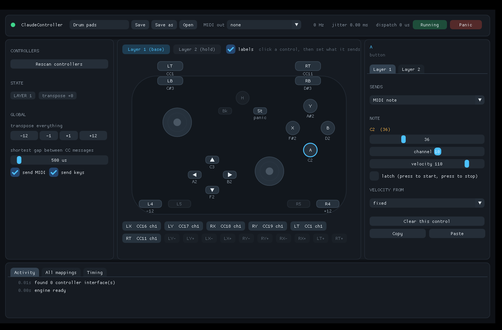

# ClaudeController

Turns a game controller into a MIDI instrument and a keyboard, on Windows, with as
little delay between the button and the sound as the hardware allows.

## Download

**[Download ClaudeController.exe](../../releases/latest/download/ClaudeController.exe)** — one
file, about 1.8 MB. Put it anywhere you like and double-click it. No installer, no runtime, no
DLLs beside it. It writes its profile next to itself and leaves the rest of the machine alone.

Built for 64-bit Windows 10 and 11. The first time you run it, Windows will probably say
*Windows protected your PC*, because the file is not code-signed: click *More info*, then
*Run anyway*. Older versions are on the [releases page](../../releases).

To send notes into a DAW you also need loopMIDI — see [MIDI into Ableton](#midi-into-ableton).

---

## First run

It asks three things before anything happens:

1. **Which controller.** Every gamepad interface Windows exposes is listed. A pad often
   shows up twice, once per interface — see *Picking the right entry* below.
2. **What it should send.** MIDI, keyboard keys, or both.
3. **A starting point.** Drum pads, chromatic notes, keyboard keys, or blank.

After that you get the main window: the pad on the left lights up as you play it, click any
control to change what it sends, and the numbers along the top tell you what the timing
actually looks like rather than what it is supposed to look like.

Your mapping is saved to `ClaudeController.profile` next to the exe — automatically a few
seconds after each change, and on exit. `Save as` keeps a named copy you can switch between.

---

## MIDI into Ableton

Windows still has no virtual MIDI cable of its own. Microsoft's new MIDI 2.0 stack adds one,
but it reaches consumers between November 2026 and January 2027, so for now you need a
third-party port:

1. Install **loopMIDI** (free, from tobias-erichsen.de).
2. Open it and press **+** to create one port. The default name `loopMIDI Port` is fine.
3. In ClaudeController, pick that port in the **MIDI out** box at the top.
4. In Ableton: *Preferences → Link/Tempo/MIDI*, find `loopMIDI Port` in the input list, and
   switch **Track** and **Remote** on.
5. Arm a MIDI track with a drum rack on it and play.

If loopMIDI ports stop appearing after a Windows 11 25H2 update, that is a known timing bug
in the new MIDI service: open *Services*, stop and start **Windows MIDI Service**, then
restart loopMIDI and this app.

---

## Which controller, and how to plug it in

This matters more than anything in the software. The controller decides the floor; no
program can report an event that has not arrived yet. Measured figures, from gamepadla's
hardware latency rig:

| Pad | Connection | Report rate | Button latency |
|---|---|---|---|
| 8BitDo Ultimate 2 Wireless | USB cable | ~956 Hz | 2.81 ms |
| 8BitDo Ultimate 2 Wireless | 2.4 GHz dongle | ~940 Hz | 3.95 ms |
| 8BitDo Ultimate 2 Wireless | Bluetooth | ~124 Hz | 12.02 ms |
| Xbox One controller | USB cable | ~125 Hz | 5.54 ms |
| Xbox One controller | Xbox dongle | ~125 Hz | 5.94 ms |
| Xbox One controller | Bluetooth | ~125 Hz | 10.23 ms |

Short version: **play on the 8BitDo, wired or on its dongle.** It reports roughly eight times
as often as the Xbox pad, and an 8 ms report interval is audible as looseness when you are
playing sixteenths. The Xbox pad is fine for holding sustained notes, pads, and CC sweeps,
and it is fine for keyboard shortcuts.

Bluetooth costs you about 8 ms on the 8BitDo and drops it to Xbox-level report rates. Avoid it
for playing.

### Picking the right entry

The device list shows one entry per interface:

- **XInput pad N** — Windows' Xbox driver. Layout is always correct, triggers are separate
  axes, polled here every 1 ms. Use this for the Xbox pad.
- **A named HID entry** — the pad's raw report. Reads at whatever rate the pad actually
  sends, which is where the 8BitDo's ~940 Hz lives.

If you connect both entries of the same physical pad, every press fires twice. Release one.

For the 8BitDo, `Home + B` at power-on puts it in DInput mode, which exposes a clean HID
gamepad with separate trigger axes. XInput mode works too, but Windows' XInput shim merges
both triggers onto a single axis, so they cancel each other out.

---

## How the controls work

**Buttons** send a note, a CC, a program change, a keystroke, a transpose, or hold layer 2.
Notes can latch (press to start, press again to stop) and can take their velocity from a stick
or trigger position, so you can play the same pad soft or hard.

**Sticks and triggers** send continuous CC or pitch bend, with deadzone, curve, output range,
invert, and a *full travel* switch that decides whether the centre reads as zero or as the
middle of the range. A CC only goes out when its 7-bit value actually changes, so a resting
stick sends nothing.

**Stick directions** (`LX-`, `LY+`, and so on, in the chip row under the pad) are separate
assignable controls with their own trip point and hysteresis, which is how you get WASD out of
a stick without it chattering on the threshold.

**Layer 2** is a whole second mapping. Map any button to *Hold layer 2* and everything changes
while you hold it. A note pressed in layer 1 still releases correctly if you switch layers
mid-press.

**Transpose** shifts every note mapping at once. Handy on the bumpers for octaves.

**Panic** sends note-off for everything currently sounding, plus all-notes-off and all-sound-off
on all sixteen channels.

### Setting up a pad whose buttons land in the wrong places

Press **Set up** on the device card. It walks through every control asking you to press or move
it, and writes down what the hardware actually reported. Nothing is sent out while that window
is open. Skip anything your pad does not have.

---

## What the numbers mean

Top bar, live: report rate, jitter, and dispatch time. The **Timing** tab at the bottom plots
the gap between reports and shows the handler's own cost.

- **Report gap** — time between two reports from the pad. This is the hardware floor.
- **Jitter** — how much that gap wobbles. Steady matters more than fast.
- **Dispatch** — how long this program takes from a report landing to the MIDI message being
  handed to the driver. It runs in tens of microseconds; it is not your bottleneck.

The full chain to a sound in Ableton is roughly: pad report interval, plus USB transfer, plus
this program's dispatch, plus loopMIDI, plus Ableton's audio buffer. The audio buffer is usually
the second largest term after the pad — at 128 samples and 48 kHz it is 2.7 ms.

### What the program does to keep its share small

- Each device gets its own thread at time-critical priority, and the process runs above normal.
- HID devices are read with an overlapped `ReadFile` that wakes the instant a report lands —
  no polling loop, no waiting for a frame.
- Raw Input devices get their own message-only window on a dedicated thread, so reports are
  never queued behind the window's repaints.
- XInput is polled on a 1 ms high-resolution waitable timer rather than a spin loop.
- The input queue is set to its minimum depth, so falling behind means dropping stale reports
  rather than playing a backlog.
- MIDI goes out on the same thread that read the report. Nothing is queued, buffered, or
  handed to another thread on the way out.
- The mapping table is read under a shared lock that costs tens of nanoseconds and is only ever
  held exclusively by the editor for a microsecond or two.

---

## Keyboard output

Keys are sent as scancodes through `SendInput`, which is what DAW shortcuts and the large
majority of games read. Games with kernel-level anti-cheat that filter injected input will not
see them; that is a deliberate block on their side, not something to work around.

---

## Profile file

`ClaudeController.profile` is plain text, one `key = value` per line, grouped in sections. It is
meant to be readable and hand-editable. Sections look like `[map 0 A]` (layer 0, the A button)
and `[device hid:2DC8:3106]`.

---

## Building it yourself

The source is in `src/`. Dear ImGui is vendored in `third_party/imgui`.

With Microsoft's compiler, from an *x64 Native Tools Command Prompt for VS*:

    build_msvc.bat

With MinGW (on Windows or cross-compiling from Linux):

    make -f build_mingw.mk

Both write `build\ClaudeController.exe`.

---

## Credits and licences

ClaudeController is MIT licensed — see `LICENSE`.

Dear ImGui by Omar Cornut, MIT licence — see `third_party/imgui/LICENSE.txt`.
Latency and polling figures quoted above are from gamepadla.com's measurements.
